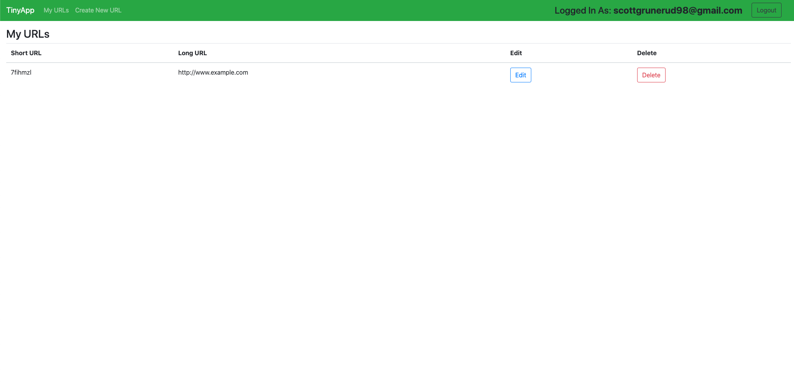
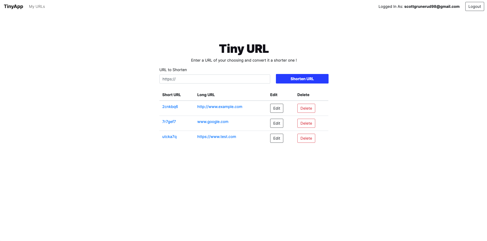

# TinyApp Project

TinyApp is a full stack web application built with Node and Express that allows users to shorten long URLs (à la bit.ly). Completed as a first assignment during my time at Lighthouse Labs.

## Expected Solution

## My Implementation

## Dependencies

- Node.js
- Express
- EJS
- bcrypt
- body-parser
- cookie-session

## Getting Started

- Install all dependencies (using the `npm install` command).
- Run the development web server using the `npm start` command.